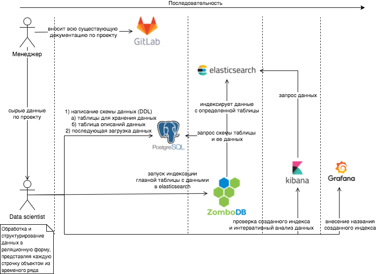

# Be modern data scientist man
You must use new technologies and especially if they solve your problems significantly faster and remove a dummy routine work away.

## Why and what for
Hey man, look there [Grafana live demo](http://play.grafana.org/d/000000012/grafana-play-home?orgId=1).
Do you know what? You could get the same powerful dashboard to analyse your data, I mean you can get your CSV data to these dashboards in the super easy way.
What I suggest is to use my little script to automate the transfer of a particular CSV file to **Postgres** and **Elasticsearch** simultaneously. **The typical use** case is shown in Figure below. Do you see it? WTF a data scientist should spend his time on these routine shown in the figure when actually you could do it by one Python line that I provide in **csv_to_sql.py** in the main method.

The CSV could be uploaded in overwrite mode or additional non-overwrite mode.

## Requirements:

### Mandatory software versions
- (Elasticsearch) 5.6.4
- (Kibana) 5.6.4
- (zombodb-es-plugin) 5.6.4-1.0.0_beta4
- (zombodb_xenial_pg95) 5.6.4-1.0.0_beta4
- (PostgreSQL) 9.5.10
- (Django) **1.11.8**

The Zombodb software and docs [link](https://github.com/zombodb/zombodb)

### No version limitations
- Grafana
- Python ecosystem
